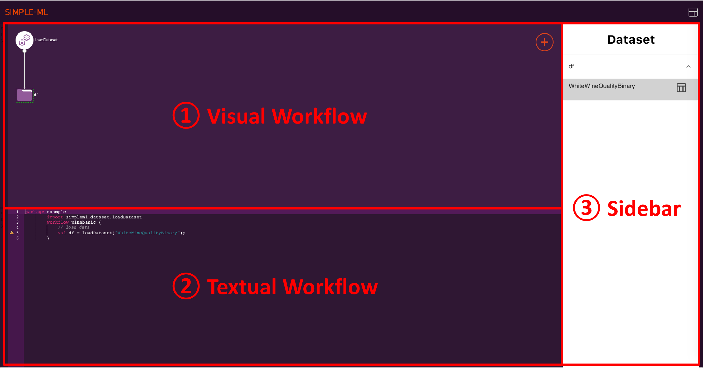
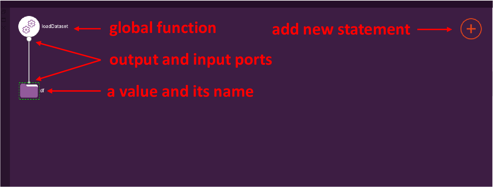
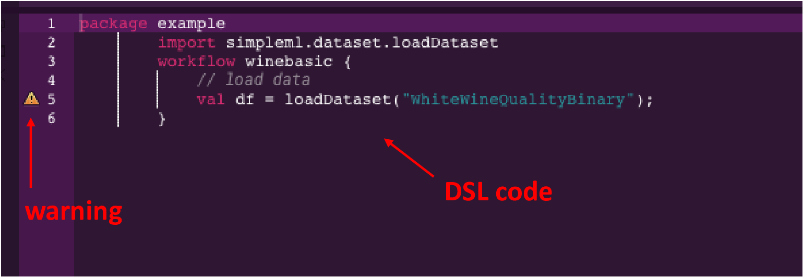

# The Simple-ML Interface

After you have started Simple-ML and created a new project, you will see the following interface:

<!--  -->

The Simple-ML consists of three major views:

1. Visual Workflow: a visual overview of your workflow
2. Textual Workflow: the DSL code describing your workflow 
3. Sidebar: Dynamic information and input forms.

## Visual Workflow

<!--  -->

The visual workflow provides you an overview of your workflow in the form of a graph. From top to bottom, you can see the functions, methods and values in the current workflow.

To create, extend and execute your workflow, you have several options:
* Use the ⊕ button in the top right to select from a set of global functions and classes that you can add.
* Click on a node in a graph to select a method which takes the clicked node as input.
* [not supported yet] Connect different nodes using their ports. 
* Click on a node in the graph and then on `Generate` to execute the workflow until this node. Afterwards, you can inspect the values in the graph. 

Whenever you add a new node to the graph, you are asked to give it a name.

## Textual Workflow

<!--  -->

The textual workflow is the DSL code specifying the ML workflow. You can simply edit and extend the code. On the left side, warnings and errors are shown. Valid code also gets visible in the visual workflow.

## Sidebar

The sidebar is shown on the right side whenever additional information is available or when your input is required. For example, you can use the sidebar to view a dataset or to get an overview of all available datasets as shown in the following.

### Overview of Datasets

Whenever you use the global function `loadDataset`, the sidebar will show an overview of all available datasets.

### Inspection of a Dataset

By clicking on a dataset node and then clicking on `View`, you can inspect a dataset in detail.

