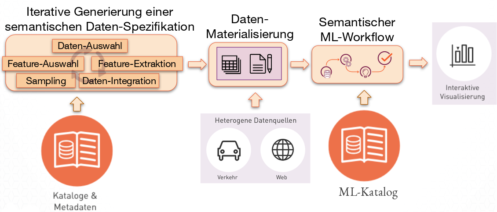

The vision of Simple-ML is to facilitate the use of Machine Learning (ML), and to make the results of ML procedures available to a wider range of applications. Simple-ML is intended support users with different backgrounds (e.g., ML experts, data scientists, business managers, etc.).

